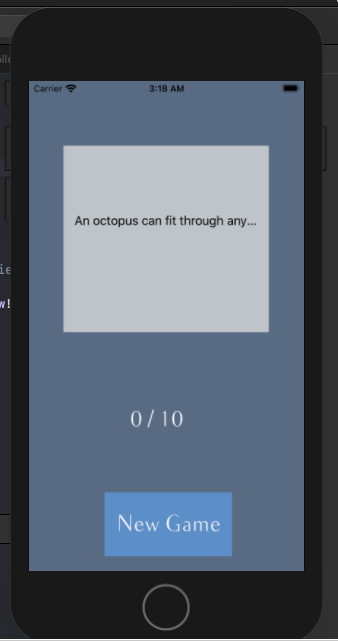

# Quizz-App-IOS
Cette Application ios est un quizz qui nous permet de repondre a 10 questions aleatorement chargees d'une API distante et qui affiche un score actualise apres
la reponse a chaque question, pour repondre, l'utilisateur doit glisser son doigt a droite ou a gauche pour choisir si la proposition est vrai ou fausse.
et a traver les listeners du controlleur on detecte cette action et on effectue des animations et des transformations visuelles.

