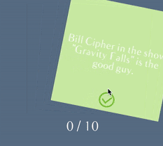
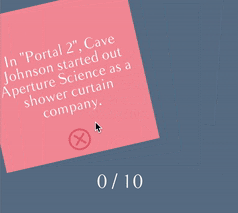
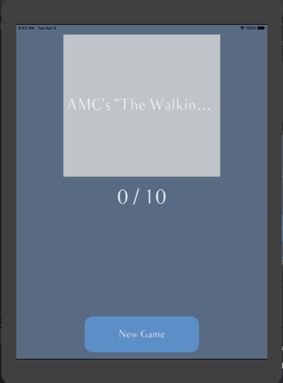

# Quizz-App-IOS
Cette Application ios est un quizz qui nous permet de repondre a 10 questions aleatorement chargees d'une API distante et qui affiche un score actualise apres
la reponse a chaque question, pour repondre, l'utilisateur doit glisser son doigt a droite ou a gauche pour choisir si la proposition est vrai ou fausse.
et a travers les listeners du controlleur on detecte cette action et on effectue des animations et des transformations visuelles.

Cette Application respecte le design pattern MVC, et le bonnes pratique du developpement, la classe game par exemple elle propose le design pattern singleton en donnant acces a une instance unique partagee pour qu'on puisse la manipuler et acceder au dit "state" de l'application, d'autre part  on n'a pas de communication directe entre le modele et la vue, mais ctte communication passe a travers un controlleur via les notifications.

En ca de glissement a droite:

En ca de glissement a gauche:

Mode paysant:

iPad ecran d'acceuil:

ipad ecran principal:

